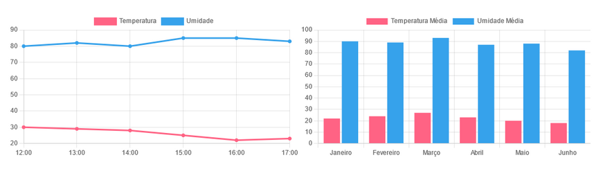

#chartjs-atividade

Atividade de pi para treinar a utilização da biblioteca [chartjs](https://www.chartjs.org/);

Foi dado como atividade a criação de dois graficos:

Com essas tabelas de dados como base:

Gráfico de Linhas:

Horário Temperatura Umidade
12:00 	    30 	       80
13:00 	    29 	       82
14:00 	    28 	       80
15:00 	    25 	       85
16:00 	    22 	       80
17:00 	    23 	       83

Gráfico de Barras:

Mês         Temperatura Média  Umidade Média
Janeiro 	    22 	                90
Fevereiro 	    24 	                89
Março 	        27 	                93
Abril 	        23 	                87
Maio 	        20 	                88
Junho 	        18 	                82
